# Kredi Kartı Harcama Analizi

Bu proje, kredi kartı işlem verilerini analiz ederek kullanıcı harcama davranışlarını anlamaya yönelik kapsamlı bir veri analizi çalışmasıdır.

## 📊 Proje Hakkında

Bu analiz, iki ayrı veri setini (kullanıcı bilgileri ve işlem verileri) birleştirerek kredi kartı harcamalarındaki örüntüleri keşfetmeyi amaçlar. Proje, veri temizleme, görselleştirme ve istatistiksel analiz adımlarını içerir.

## 📁 Veri Setleri

### 1. users.csv
- **User**: Kullanıcı ID'si
- **Card**: Kart numarası
- **Year**: Kartın çıkarıldığı yıl
- **Month**: Kartın çıkarıldığı ay
- **Day**: Kartın çıkarıldığı gün
- **Gender**: Cinsiyet
- **Per Capita Income - Zipcode**: Posta kodu bazında kişi başı gelir
- **Yearly Income - Person**: Kişinin yıllık geliri
- **Total Debt**: Toplam borç
- **FICO Score**: Kredi skoru
- **Num Credit Cards**: Sahip olunan kredi kartı sayısı
- **Address**: Adres bilgileri (City, State, Zipcode, Apartment)
- **Current Age**: Mevcut yaş
- **Retirement Age**: Emeklilik yaşı

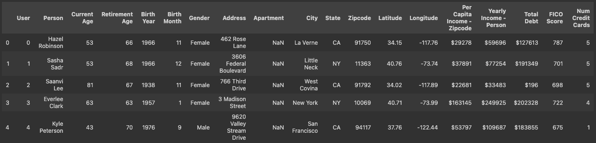
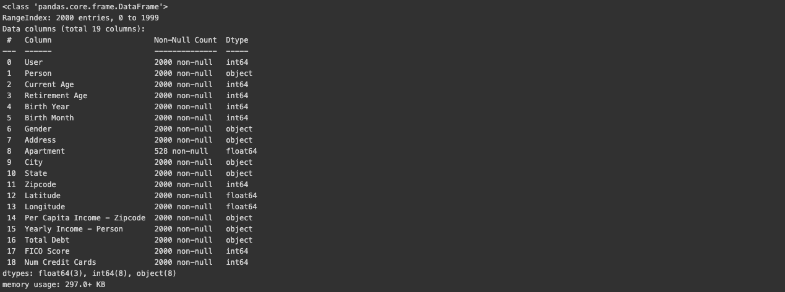

### 2. transactions.csv
- **User**: Kullanıcı ID'si
- **Card**: Kart numarası
- **Year/Month/Day/Time**: İşlem zamanı
- **Amount**: İşlem tutarı
- **Use Chip**: Chip kullanımı
- **Merchant Name**: Satıcı adı
- **Merchant City/State**: Satıcı konumu
- **Zip**: Posta kodu
- **MCC**: Merchant Category Code
- **Errors?**: Hata bilgisi
- **Is Fraud?**: Dolandırıcılık durumu

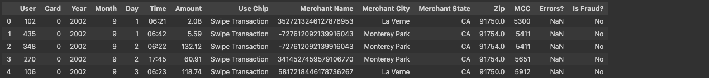
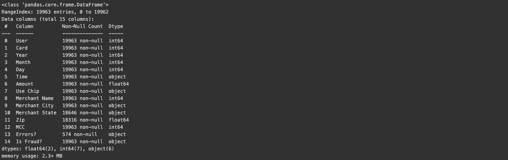

## 🛠️ Kullanılan Teknolojiler

- **Python 3.x**
- **pandas**: Veri manipülasyonu ve analizi
- **numpy**: Sayısal hesaplamalar
- **matplotlib**: Temel görselleştirme
- **seaborn**: Gelişmiş görselleştirme
- **jupyter**: Etkileşimli analiz ortamı

## 📋 Kurulum

1. Gerekli kütüphaneleri yükleyin:

```bash
pip install pandas numpy matplotlib seaborn jupyter
```

2. Proje dosyalarını klonlayın veya indirin

3. Veri dosyalarını (`users.csv` ve `transactions.csv`) proje dizinine yerleştirin

4. Jupyter Notebook'u başlatın:

```bash
jupyter notebook proje.ipynb
```

## 🔄 Veri Ön İşleme Adımları

### Users Veri Seti
- ✅ Para birimi işaretlerinin ($) kaldırılması

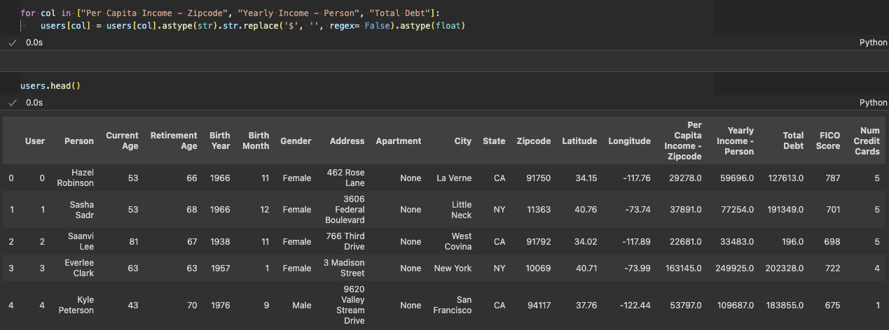

- ✅ Numerik sütunların uygun veri tipine dönüştürülmesi

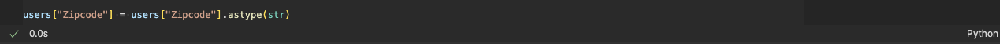

- ✅ Boş değerlerin uygun şekilde doldurulması

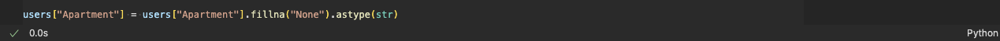

- ✅ Tekrarlayan kayıtların temizlenmesi

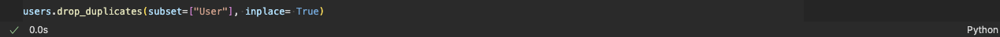

### Transactions Veri Seti
- ✅ Online işlemlerin uygun şekilde etiketlenmesi

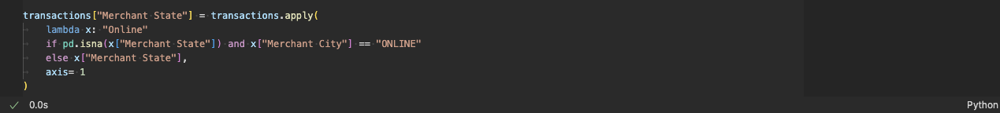


- ✅ Tarih sütunlarının datetime formatına birleştirilmesi

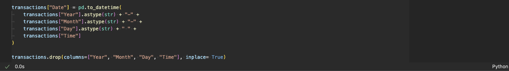

- ✅ Binary sütunların (Yes/No) numerik formata (0/1) dönüştürülmesi


- ✅ Hata durumlarının kategorize edilmesi

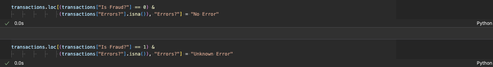

- ✅ Tekrarlayan kayıtların temizlenmesi

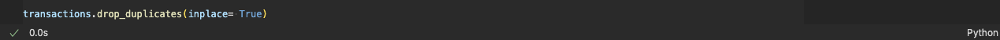

### Veri Setlerinin Birleştirilmesi
İki veri seti "User" sütunu üzerinden inner join ile birleştirildi.

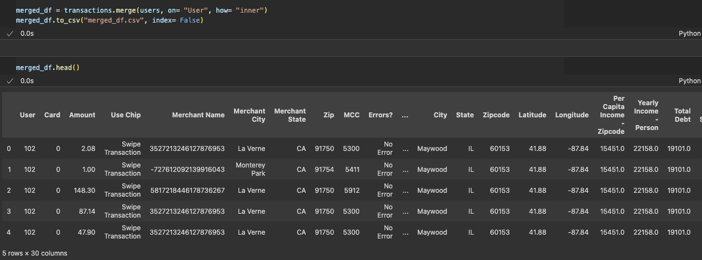

## 📈 Analiz Sonuçları

### 1. En Fazla Harcama Yapılan Şehirler

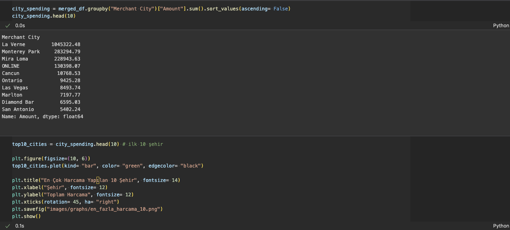
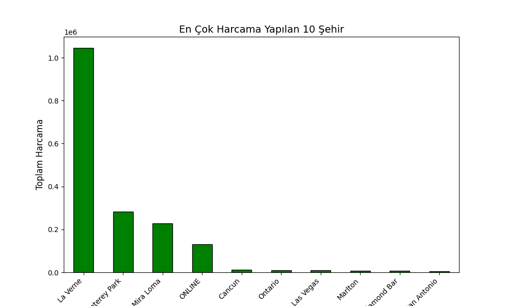

**Bulgular:**
- En çok harcama yapılan şehir: **La Verne**
- Online işlemler 4. sırada yer alıyor
- Fiziksel mağaza vs. online alışveriş dengesi gözlemleniyor

### 2. Saatlik Harcama Dağılımı

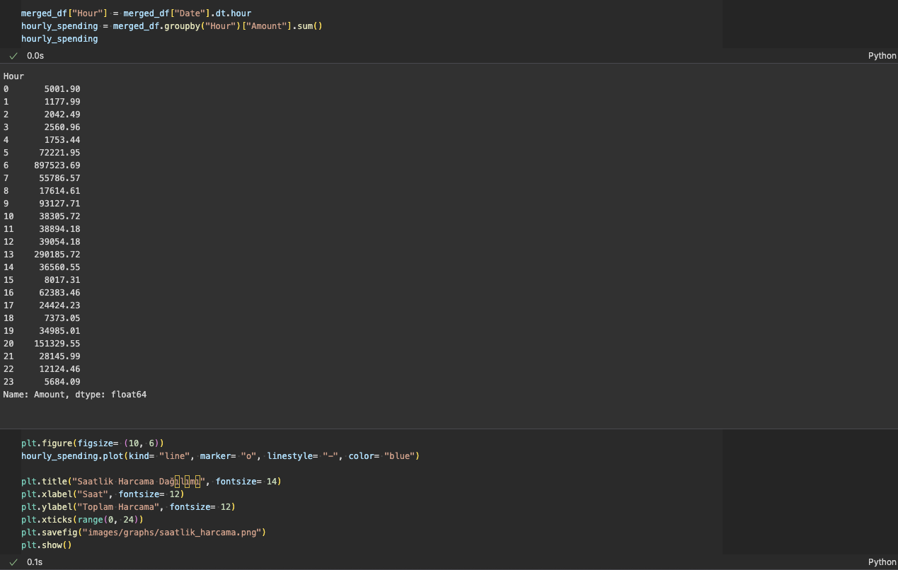
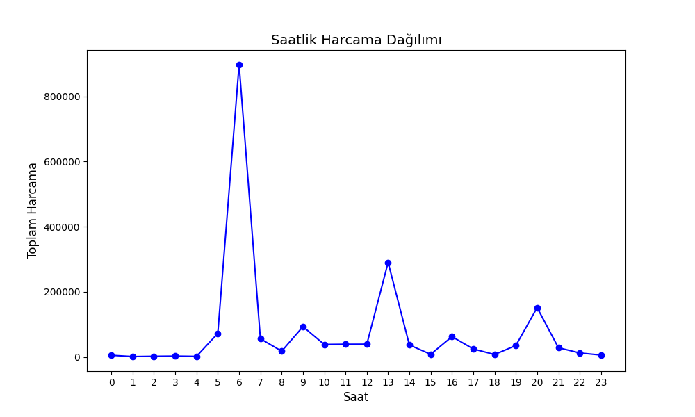

**Bulgular:**
- **Sabah 06:00**: En yüksek harcama yoğunluğu
- **Öğle 13:00**: Öğle molası harcama artışı
- **Akşam 20:00**: İkinci büyük harcama dalgası
- **Gece 00:00-04:00**: En düşük harcama dönemı

### 3. Cinsiyete Göre Harcama

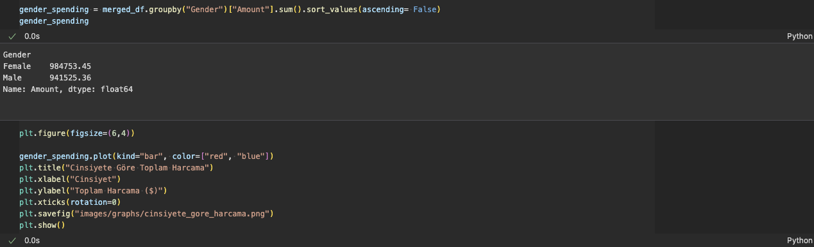
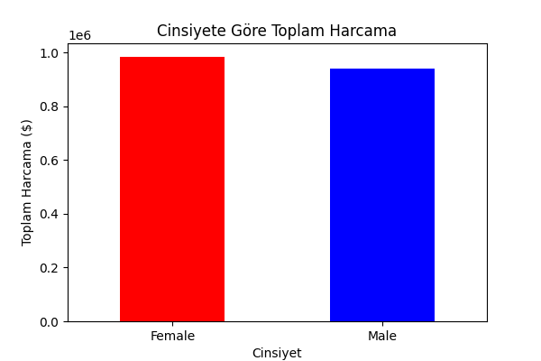

**Bulgular:**
- Kadın ve erkek kullanıcılar arasında dengeli harcama dağılımı
- Kadın kullanıcılar hafif üstünlük gösteriyor
- Cinsiyet bazında büyük fark gözlenmiyor

### 4. Gelir vs. Harcama İlişkisi

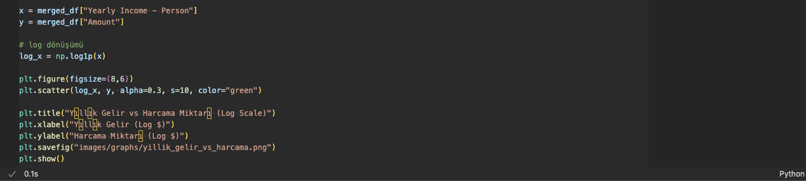


**Bulgular:**
- Genel olarak gelir arttıkça harcama artış eğilimi
- Orta gelir grubunda yoğun veri dağılımı
- Düşük ve yüksek gelir gruplarında uç noktalar mevcut

### 5. Yaş Gruplarına Göre Ortalama Harcama

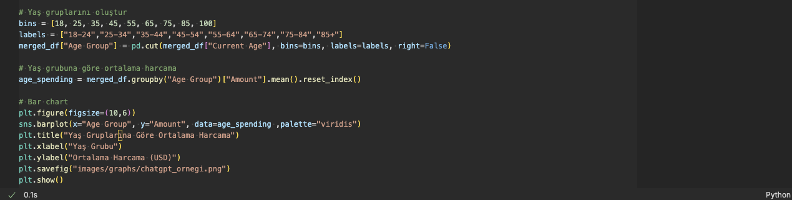
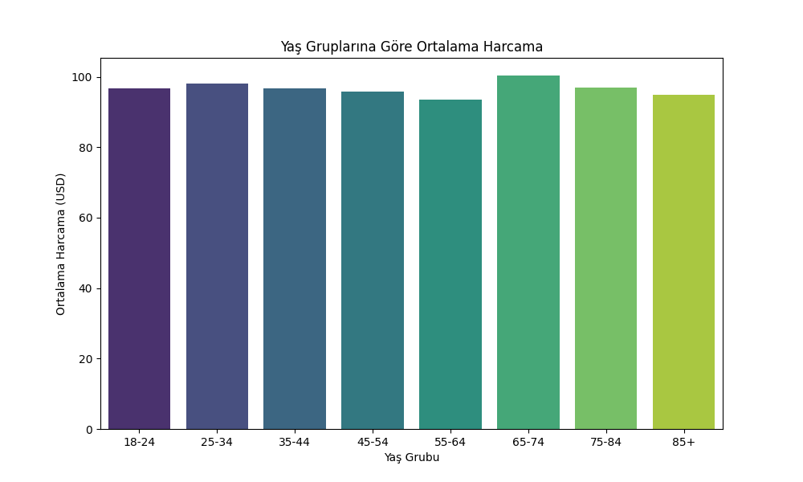

**Bulgular:**
- Farklı yaş gruplarının harcama davranışları analiz edildi
- Yaş ile harcama miktarı arasındaki ilişki görselleştirildi

## 🎯 Temel İçgörüler

1. **Zaman Bazlı Trendler**: Harcamalar belirli saatlerde yoğunlaşıyor
2. **Coğrafi Dağılım**: Bazı şehirler harcama merkezleri olarak öne çıkıyor
3. **Online vs. Offline**: Digital dönüşümün harcama davranışlarına etkisi
4. **Demografik Etkiler**: Yaş ve cinsiyet faktörlerinin rolü
5. **Gelir-Harcama Korelasyonu**: Ekonomik durumun harcama üzerindeki etkisi